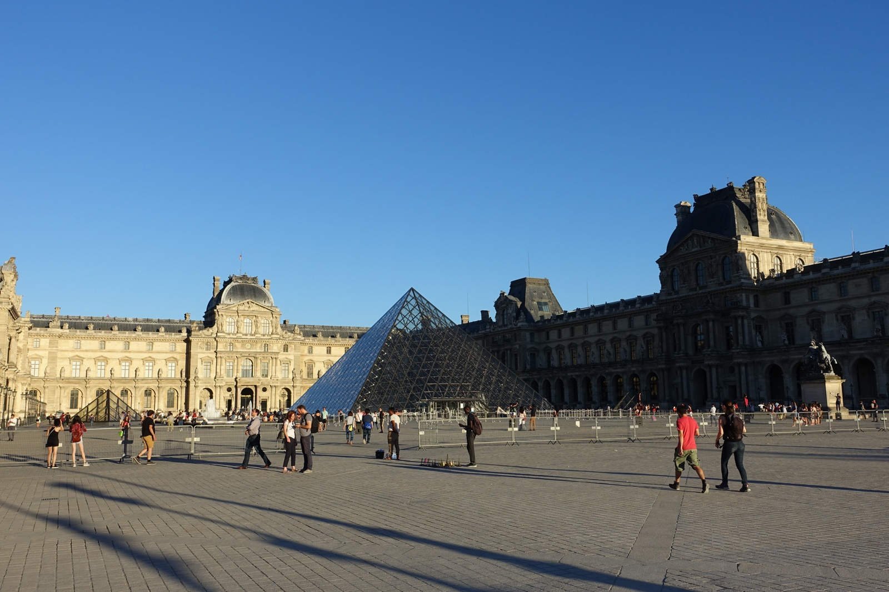
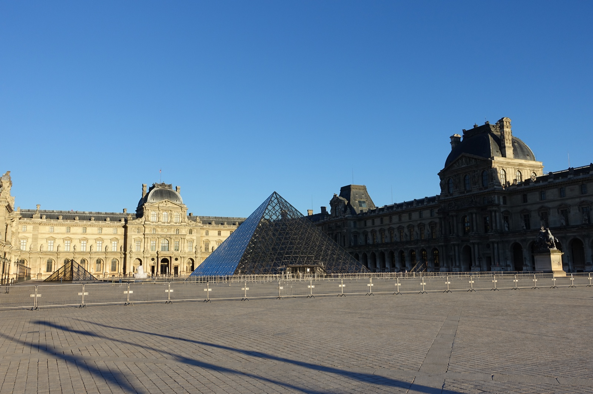
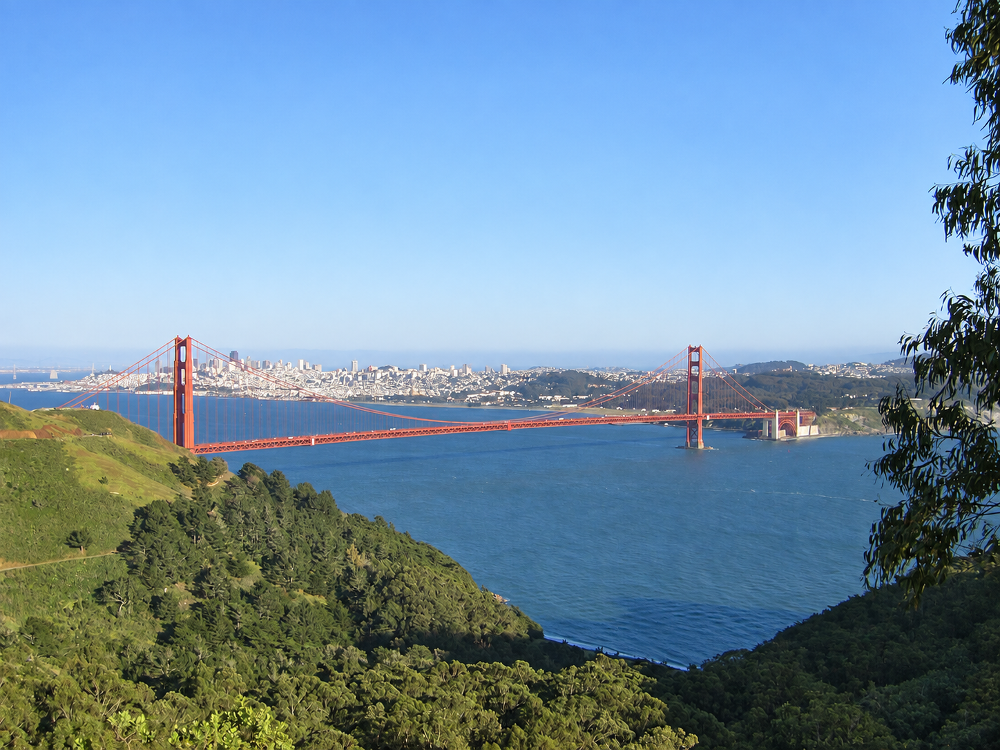
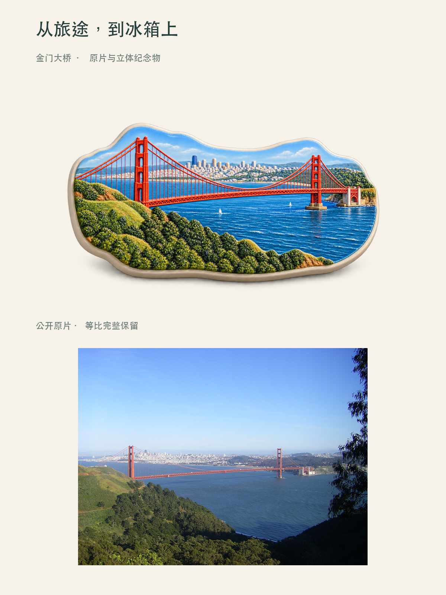

<p align="center">
  
</p>

<p align="center">
  <strong>修好一张旅照，收藏一段旅程。</strong><br>
  从自然调光、去除游客，到明信片、旅行玻璃球和真实地图海报。
</p>

<p align="center">
  <a href="#案例展示">看案例</a> ·
  <a href="#开始使用">开始使用</a> ·
  <a href="#常见场景">常见场景</a> ·
  <a href="#18-种玩法">全部玩法</a> ·
  <a href="#文档与开发">开发文档</a>
</p>

HappyTrip 是一个 **Codex 旅行照片 Skill**。附上照片，用中文描述想要的效果，它会选择相应模式，整理素材、制作图片并核对结果。

## 案例展示

六个案例覆盖照片修改、光色优化、纪念物创作和旅程整理。素材为公开授权的巴黎、旧金山照片，不代表个人旅行记录。[查看素材署名与制作记录](docs/examples/README.md)。

### 01 · 去掉挡住风景的游客

**A01 去除游客** — 将卢浮宫广场中的游客和对应影子移除，保留金字塔、建筑、围栏与雕像。

| 公开原片 | 清理后 |
| :---: | :---: |
|  |  |

```text
用 $happytrip 的 A01，去掉这张建筑照片中的全部游客和他们的影子。
保留建筑、金字塔、围栏、雕像、构图和原有光线。
```

本例没有需要保留的同行人。被遮挡的地面属于推断性补全；天空和建筑上部复用原片，不作重绘。

### 02 · 让照片的暗部更通透

**A02 自然调光** — 提亮金门大桥前景的暗部，调整白平衡与色彩层次，保留整体构图。

| 公开原片 | 光影与色彩优化 |
| :---: | :---: |
|  |  |

```text
用 $happytrip 的 A02，自然优化这张照片的曝光、白平衡和色彩。
适度提亮前景暗部，减轻偏冷；不换天空，不改建筑，不删除任何物体。
```

这是 AI 编辑示例，细小纹理可能重绘，不是逐像素无损调色。

### 03 · 做一枚属于这个景点的冰箱贴

**B01 原片＋冰箱贴** — 先制作金门大桥立体纪念物，再把完整原照片放进下方对照区。

<p align="center">
  <a href="docs/examples/b01-magnet-poster.png">
    
  </a>
</p>

```text
用 $happytrip 的 B01，把照片中的金门大桥做成立体冰箱贴。
用本地合成排成上方纪念物、下方完整原片的对照海报。
冰箱贴不写文字，原照片不裁切、不重绘。
```

下方照片来自登记原片，等比缩放完整放置。冰箱贴是创意生成的纪念物，不是实体商品。

### 04 · 把风景画成明信片

**A05 水彩明信片 · 无字版** — 把金门大桥转绘到暖米白纸面，留出题字空间，配上三枚景物色块。

| 场景原片 | 水彩明信片 |
| :---: | :---: |
|  |  |

```text
用 $happytrip 的 A05，把这张照片做成水彩明信片。
右侧画景点，左侧留白，保留三枚色块，不加任何文字。
```

### 05 · 把风景装进玻璃球

**B04 旅行玻璃球** — 从 39 号码头的木栈道和临水建筑，提炼一件微缩纪念物。

| 场景原片 | 创意重构 |
| :---: | :---: |
|  |  |

```text
用 $happytrip 的 B04，把照片中的码头做成旅行玻璃球。
保留建筑和木栈道的特点，不加雪，也不写文字。
```

### 06 · 把照片放回地图

**B22 旅行地图海报** — 三张地标照片，配上真实街道底图、拍立得和编号地点卡。

<p align="center">
  <a href="docs/examples/b22-map-preview.png">
    
  </a>
</p>

示例使用 USGS 底图。红色虚线仅表示站点关联，**不是实际道路路线**。支持 2–15 张照片；所有选中照片都有对应地点卡，缺少的日期、天气和里程不自动补写。

```text
用 $happytrip 的 B22，以本地原片排版制作旅行地图海报。
这三张照片依次对应金门大桥、39 号码头、渡轮大楼。
使用有来源的真实地图；没有道路轨迹就标注为站点连线。
不要添加日期、天气或里程。
```

制作自己的地图时，请提供照片与地点的对应关系、地点坐标或可核实来源，以及需要展示的站点顺序。地图不会根据风格参考图猜测你的行程。[查看地图制作说明](happytrip/references/route-photo-map.md)。

## 常见场景

从拍照时遇到的问题出发，选对应的玩法。前六类已有上方实图；其余提供可复制提示词，按你自己的素材制作。

| 你想解决什么 | 对应玩法 |
| --- | --- |
| 景点人太多，想留下干净建筑 | **A01** 去除背景游客 |
| 照片偏暗、偏黄、发灰 | **A02** 自然调光与色彩优化 |
| 把地标做成旅行冰箱贴 | **B01** 立体纪念物＋完整原片 |
| 给朋友寄一张旅行明信片 | **A05** 水彩景点明信片 |
| 把喜欢的风景装进玻璃球 | **B04** 微缩旅行纪念物 |
| 把多张照片放回对应地点 | **B22** 真实地图海报 |
| 人像有些疲惫，想自然修整 | **A03** 轻度人像修饰，保留脸型与肤质 |
| 给照片加一句话、箭头或手绘 | **A12** 照片注释与独立装饰层 |
| 旅行照片很多，想做一张合集 | **A07** 行李箱内的旅行碎片贴纸 |
| 用三四张照片讲述一段旅途 | **B16** 三格／四格旅行漫画 |
| 让食物或饮料更有动感 | **A10** 美食创意特效 |
| 做一张以自己为主角的旅行海报 | **A08** 人物旅行海报 |

**[打开 12 个场景的完整提示词与素材要求 →](docs/common-scenarios.md)**

## 开始使用

### 安装到 Codex

在 macOS / Linux 终端运行：

```bash
git clone https://github.com/coolbat/HappyTrip.git
cd HappyTrip
mkdir -p ~/.codex/skills
if [ ! -e ~/.codex/skills/happytrip ] && [ ! -L ~/.codex/skills/happytrip ]; then
  ln -s "$PWD/happytrip" ~/.codex/skills/happytrip
fi
```

保留整个 `happytrip/` 目录，它包含模式卡、参考资料和辅助脚本。若已安装同名 Skill，先确认现有路径；上述命令不覆盖旧安装。其他环境也可将整个目录复制到 Codex 的技能目录。

### 附上照片，说出想法

安装后新建 Codex 会话，上传照片并输入：

```text
用 $happytrip 看看这张旅行照片适合怎么处理，给我 2–3 个建议。
```

也可以直接指定目标：

```text
用 $happytrip，把这张照片做成水彩明信片，不写日期。
```

普通生成与编辑需要当前 Codex 会话提供图像工具。地图、原片对照和准确文字排版等本地流程还需要 Python 3.10+ 与 Pillow；[配置方法见下方](#文档与开发)。

## 18 种玩法

不必记住编号，直接描述目标也能选择玩法。编号适合复用喜欢的效果。

| 想做什么 | 可以尝试 |
| --- | --- |
| **修好照片** | A01 去除背景游客 · A02 自动调光 · A03 自然人像修整 |
| **收藏旅途** | A05 水彩明信片 · A07 碎片行李箱 · B01 原片＋冰箱贴 · B03 立体纸雕明信片 · B04 旅行玻璃球 · B22 照片地图 |
| **玩出新意** | A06 主体贴纸化 · A09 演唱会氛围 · A10 美食炸弹 · A11 文字构成物体 · A12 照片注释 |
| **讲述旅程** | A04 拍立得 3D 公仔 · A08 人物旅行海报 · B14 双重曝光 · B16 三格／四格漫画 |

完整输入数量、编辑范围与验收项见 [模式目录](happytrip/references/catalog.json)。

## 照片与事实，分别照顾

- **原文件只读**：制作使用工作副本；需要原片对照的模式明确记录原照片的去向。
- **按要求编辑**：调光不自动换天空，去路人先明确保留谁；创意重构与照片修整有不同边界。
- **不知道就省略**：未提供的日期、天气和里程不编造；未确认顺序的地点不画成行程路线。
- **看图后再交付**：文件生成、程序检查、视觉复核和你的审美认可分别记录。

## 文档与开发

| 文档 | 适合什么时候看 |
| --- | --- |
| [Skill 入口](happytrip/SKILL.md) | 了解使用规则与模式选择 |
| [Codex 接入](happytrip/references/codex-host.md) | 了解图像工具与本地合成的配合 |
| [地图海报指南](happytrip/references/route-photo-map.md) | 准备底图、地点、原照片和轨迹 |
| [本地执行器](happytrip/references/runtime.md) | 素材登记、计划、生成交接、合成与导出 |
| [常见场景手册](docs/common-scenarios.md) | 按具体问题找到提示词和素材要求 |
| [案例来源与记录](docs/examples/README.md) | 查看公开素材许可与实际示例的制作方式 |
| [验证报告](checks/VALIDATION-REPORT.md) | 区分程序验证、开发预览与实图效果 |
| [原始需求与设计](HappyTrip_V1_Package/README.md) | 追溯设计来源与产品边界 |

<details>
<summary>配置本地辅助程序与运行测试</summary>

本地辅助程序不包含第三方生图 API 客户端，图像生成由宿主工具执行。

```bash
python3 -m venv .venv
.venv/bin/python -m pip install -r requirements-dev.txt
.venv/bin/python happytrip/scripts/happytrip.py doctor
.venv/bin/python happytrip/scripts/happytrip.py catalog
PYTHONPATH=happytrip/scripts .venv/bin/python -m unittest discover -s tests -v
```

当前版本 **1.1.1**；已记录 **111 项程序测试通过**。这些检查不等于 18 种玩法全部通过真实图片验收。地图不提供在线导航，创意案例不代表真实商品或真实行程。

</details>

---

从一张照片开始。新建会话，附上照片，告诉 **`$happytrip`** 你想保留什么、改变什么。
